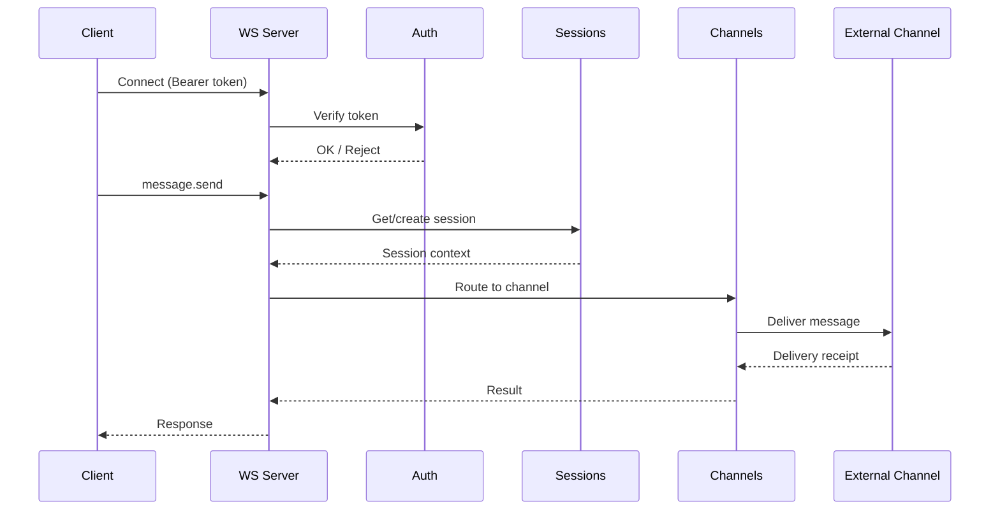
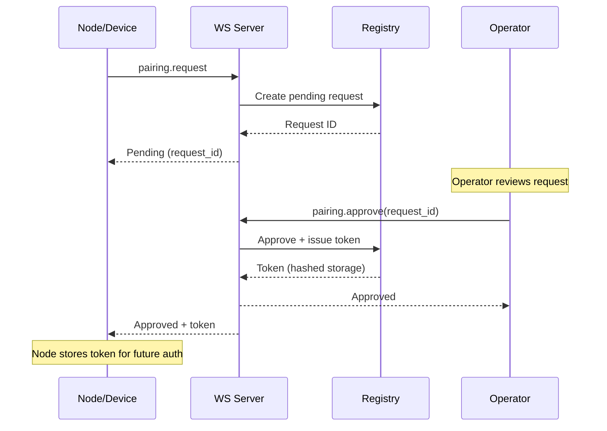
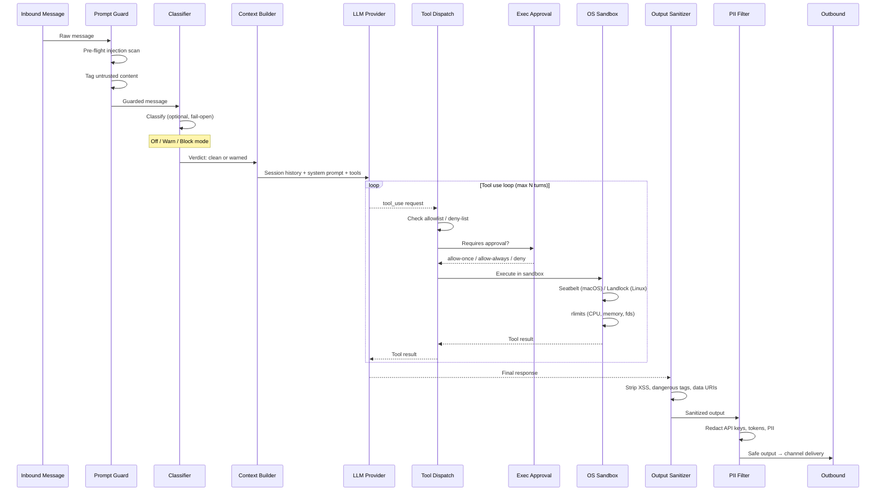

# carapace Architecture

High-level overview of carapace components and their relationships.

## Component Diagram

```mermaid
graph TB
    subgraph Clients
        CLI[CLI / Control UI]
        Mobile[Mobile Apps]
        ExtNodes[External Nodes]
    end

    subgraph "Gateway Core"
        subgraph "Transport Layer"
            WS[WS Server<br/>JSON-RPC]
            HTTP[HTTP Gateway]
        end

        subgraph "Security"
            Auth[Auth<br/>tokens, passwords, loopback]
            RateLimit[Rate Limiter]
        end

        subgraph "Routing & Dispatch"
            Channels[Channel Registry]
            Messages[Outbound Messages]
            Hooks[Hook Mappings]
        end

        subgraph "State Management"
            Sessions[Session Store<br/>JSONL history, archiving]
            Nodes[Node Registry<br/>pairing, tokens]
            Devices[Device Registry<br/>pairing, tokens]
            Cron[Cron Scheduler<br/>scheduled jobs]
            ExecMgr[Exec Approvals<br/>tool execution gates]
        end

        subgraph "Voice & TTS"
            TTS[TTS Providers<br/>text-to-speech]
            VoiceWake[Voice Wake<br/>trigger detection]
            TalkMode[Talk Mode<br/>voice interaction state]
        end

        subgraph "Extensions"
            Plugins[Plugin Runtime<br/>WASM/wasmtime]
            PluginDispatch[Plugin Dispatch<br/>tools, webhooks, hooks]
        end

        subgraph "Infrastructure"
            Logging[Log Buffer<br/>tracing, ring buffer]
            Media[Media Pipeline<br/>fetch, store]
            Creds[Credential Store]
            Usage[Usage Tracking<br/>token costs]
        end
    end

    subgraph "External Services"
        Telegram[Telegram]
        Discord[Discord]
        Slack[Slack]
        Signal[Signal]
        OtherCh[Other Channels...]
    end

    subgraph "Storage"
        FS[(Config Dir<br/>~/.config/carapace (Linux))]
    end

    %% Client connections
    CLI --> WS
    CLI --> HTTP
    Mobile --> WS
    ExtNodes --> WS

    %% Transport to security
    WS --> Auth
    HTTP --> Auth
    WS --> RateLimit
    HTTP --> RateLimit

    %% Core routing
    Auth --> Channels
    Auth --> Sessions
    Channels --> Messages
    Messages --> Telegram
    Messages --> Discord
    Messages --> Slack
    Messages --> Signal
    Messages --> OtherCh

    %% Hooks flow
    HTTP --> Hooks
    Hooks --> Messages

    %% State management
    Sessions --> FS
    Nodes --> FS
    Devices --> FS
    Creds --> FS
    Cron --> FS
    Cron --> Sessions

    %% Plugin integration
    Plugins --> PluginDispatch
    PluginDispatch --> Channels
    PluginDispatch --> Hooks

    %% Media flow
    Messages --> Media
    Media --> FS
```

## Request Flow



## Pairing Flow (Nodes/Devices)

See [Pairing Protocol](protocol/pairing.md) for detailed protocol documentation.



## Agent Execution Pipeline



## Key Files

| Component | Path | Description |
|-----------|------|-------------|
| WS Server | `src/server/ws/` | WebSocket JSON-RPC, method dispatch |
| HTTP Gateway | `src/server/http.rs` | HTTP endpoints, static files |
| OpenAI Compat | `src/server/openai.rs` | /v1/chat/completions, /v1/responses |
| Control API | `src/server/control.rs` | /control/status, /control/channels |
| Auth | `src/auth/mod.rs` | Token/password verification, loopback detection |
| Channels | `src/channels/mod.rs` | Channel registry, status tracking |
| Sessions | `src/sessions/store.rs` | Session CRUD, JSONL history, compaction, archiving |
| Nodes | `src/nodes/mod.rs` | Node pairing state machine |
| Devices | `src/devices/mod.rs` | Device pairing state machine |
| Cron | `src/cron/mod.rs` | Scheduled job management, run history |
| Exec Approvals | `src/exec/mod.rs` | Tool execution approval workflow |
| TTS | `src/server/ws/handlers/tts.rs` | Text-to-speech provider abstraction |
| Voice Wake | WS handler | Wake word trigger management |
| Talk Mode | WS handler | Voice interaction state machine |
| Usage | WS handler | Token/cost tracking |
| Plugins | `src/plugins/runtime.rs` | WASM plugin loading, wasmtime |
| Plugin Dispatch | `src/plugins/dispatch.rs` | Tool/webhook/hook routing |
| Hooks | `src/hooks/registry.rs` | Webhook transformations, templates |
| Messages | `src/messages/outbound.rs` | Outbound message queue |
| Media | `src/media/` | Media fetch, store, pipeline |
| Credentials | `src/credentials/mod.rs` | Encrypted credential storage |
| Venice Provider | `src/agent/venice.rs` | Venice AI provider (OpenAI-compatible composition) |
| Classifier | `src/agent/classifier.rs` | Inbound message classifier (prompt injection, social engineering) |
| Logging | `src/logging/mod.rs` | tracing setup, ring buffer, log tail streaming |

## Design Decisions

- **Async runtime**: tokio
- **WS library**: tokio-tungstenite
- **HTTP framework**: axum
- **Serialization**: serde + serde_json
- **Concurrency**: parking_lot (RwLock), Arc for shared state
- **Plugin runtime**: wasmtime (WASM component model)
- **Token security**: SHA-256 hashing, constant-time comparison
- **Persistence**: Atomic writes (temp file + rename)
