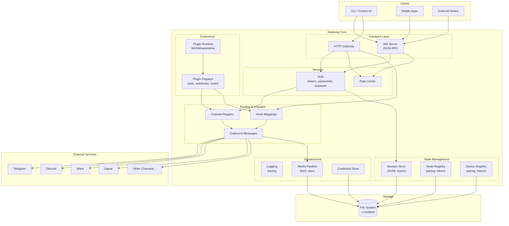
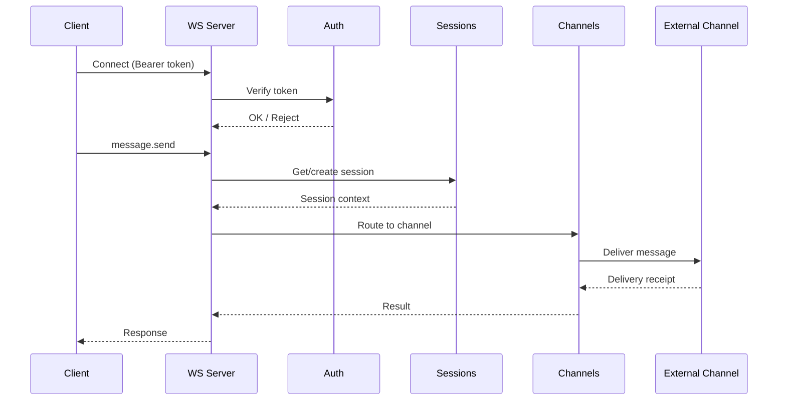
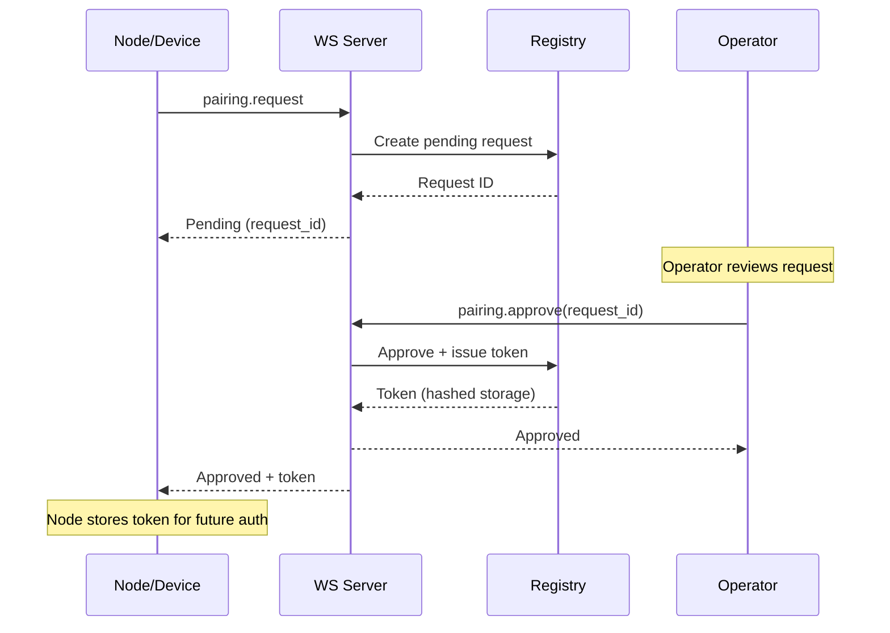

# carapace Architecture

High-level overview of the Rust gateway components and their relationships.

## Component Diagram

## Request Flow

## Pairing Flow (Nodes/Devices)

See [Pairing Protocol](protocol/pairing.md) for detailed protocol documentation.

## Key Files

| Component | Path | Description |
|-----------|------|-------------|
| WS Server | `src/server/ws/` | WebSocket JSON-RPC, method dispatch |
| HTTP Gateway | `src/server/http.rs` | HTTP endpoints, static files |
| OpenAI Compat | `src/server/openai.rs` | /v1/chat/completions, /v1/responses |
| Control API | `src/server/control.rs` | /control/status, /control/channels |
| Auth | `src/auth/mod.rs` | Token/password verification, loopback detection |
| Channels | `src/channels/mod.rs` | Channel registry, status tracking |
| Sessions | `src/sessions/store.rs` | Session CRUD, JSONL history, compaction |
| Nodes | `src/nodes/mod.rs` | Node pairing state machine |
| Devices | `src/devices/mod.rs` | Device pairing state machine |
| Plugins | `src/plugins/runtime.rs` | WASM plugin loading, wasmtime |
| Plugin Dispatch | `src/plugins/dispatch.rs` | Tool/webhook/hook routing |
| Hooks | `src/hooks/registry.rs` | Webhook transformations, templates |
| Messages | `src/messages/outbound.rs` | Outbound message queue |
| Media | `src/media/` | Media fetch, store, pipeline |
| Credentials | `src/credentials/mod.rs` | Encrypted credential storage |
| Logging | `src/logging/mod.rs` | tracing setup, log rotation |

## Design Decisions

- **Async runtime**: tokio
- **WS library**: tokio-tungstenite
- **HTTP framework**: axum
- **Serialization**: serde + serde_json
- **Concurrency**: parking_lot (RwLock), Arc for shared state
- **Plugin runtime**: wasmtime (WASM component model)
- **Token security**: SHA-256 hashing, constant-time comparison
- **Persistence**: Atomic writes (temp file + rename)
