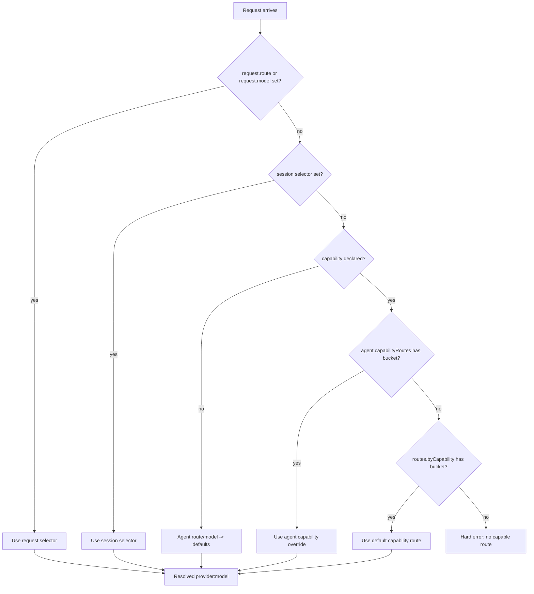

# Capability-Aware Routing for Multimodal Workflows

Status: design proposal (issue #189)
Owner: routes/agent layer (`src/config/routes.rs`, `src/agent/factory.rs`)
Scope: gateway request resolution; no provider-side capability negotiation.

## Problem

Carapace exposes a single execution target per agent through
`agents.defaults.model` and the `routes` map (`src/config/routes.rs`,
`src/agent/provider.rs`). Multimodal-adjacent work today is shipped at the
*tool* layer: `src/media/` runs Claude Vision, GPT-4 Vision, and Whisper
transcription as side calls (see `feature-status.yaml`, Media section). There
is no first-class way to say "for this turn, route to a vision-capable model"
or "use a different backend when the agent is asked to generate an image."

The result is that an operator who configures `agents.defaults.route: "fast"`
to a non-vision model has no recourse short of swapping agents or models
manually at request time. That is the friction this design removes.

The proposal here defines a typed, explicit capability override that composes
with the existing named-routes precedence chain rather than replacing it.

## Non-goals (first slice)

- Automatic capability detection from request payloads or MIME sniffing.
- Automatic failover between models on capability mismatch.
- Cost-aware or latency-aware routing.
- Provider-side capability negotiation or feature flags discovered at
  runtime.
- A general-purpose multi-agent dispatcher.

## 1. Capability buckets

Initial typed enum:

| Capability | Reason in scope | Backed by today |
|---|---|---|
| `vision` | Already shipped via `src/media/` Claude Vision + GPT-4 Vision. Routing UX is the gap. | `feature-status.yaml` Media section |
| `image_generation` | Carapace ships Venice provider but has no first-class generate-image route. Highest user-visible win for the slice. | `src/agent/venice.rs` |
| `audio_transcription` | Whisper already shipped. Inclusion lets transcription runs target an OpenAI-compat or local backend distinct from chat. | `feature-status.yaml` Media |
| `reasoning` | Listed as a candidate in the issue; included to validate that non-multimodal capabilities fit the same shape. Routes to higher-tier models (e.g. `anthropic:claude-opus-*`). | n/a (new) |

Excluded from the typed enum for the first slice:

- `code_execution`, `web_browsing`, `function_calling` — already covered by
  the tool dispatch and prompt-guard layers; no routing decision to make.
- `tts` — TTS providers are an orthogonal abstraction (`src/server/ws/handlers/tts.rs`)
  that does not flow through `LlmProvider::complete`.
- `embeddings` — no shipped surface yet; defer until embeddings are a
  first-class request type.

The enum is closed (`#[non_exhaustive]` on the public surface so future
variants do not break consumers, but exhaustively matched internally). New
buckets require a typed enum addition and a config schema update — they are
not arbitrary strings.

## 2. Where capability routes live in config

Primary form: dedicated map under `routes.byCapability.*`.

```json5
routes: {
  fast: { model: "anthropic:claude-sonnet-4-20250514" },
  smart: { model: "anthropic:claude-opus-4-20250514" },
  byCapability: {
    vision:             { route: "smart" },
    imageGeneration:    { model: "venice:flux-1.1-pro" },
    audioTranscription: { model: "openai:whisper-1" },
    reasoning:          { route: "smart" },
  },
},
```

Each capability entry is a `RouteConfig`-shaped pointer that may carry either
`route` (delegate to a named route) or `model` (direct provider:model). The
existing `RouteConfig` shape from `src/config/routes.rs` is reused; capability
entries are not a parallel type.

Why this form, not per-agent overrides or `agents.defaults` chains:

- **Single source of truth for "where do I route X":** an operator answers
  "what model handles vision?" by reading one config block. With per-agent
  overrides, the answer fans out across every agent.
- **Composes cleanly with named routes:** capability routes can themselves
  be `route` references, so an operator can say "vision uses our `smart`
  route" without duplicating the model string.
- **Backwards-compatible:** `routes.byCapability` is a new, optional sub-key
  under the existing `routes` object. Configs that omit it behave exactly as
  today.

How the alternatives compose with this primary form:

- **Per-agent capability overrides** (`agents.list[].capabilityRoutes.vision`)
  remain valid and override the global default. They are a precedence level
  above `routes.byCapability` (see §3), not an alternative storage location.
- **`agents.defaults.capabilityRoutes`** is the lowest-priority fallback when
  `routes.byCapability` is not set. This mirrors the existing
  `agents.defaults.model` shape and keeps the onboarding contract
  (`docs/architecture.md` "Shared Provider Onboarding Contract") intact.

## 3. Resolution order at request time

A request that declares a capability resolves through the existing
`SelectorLevel` chain, augmented with a capability-route lookup that runs
*before* the existing model lookup at each scope.

Precedence, highest to lowest:

1. Request override — caller passed `route` or `model` directly.
2. Session override — session-pinned `route`/`model`.
3. Agent override — `agent.capabilityRoutes.<bucket>` if set.
4. Default capability route — `routes.byCapability.<bucket>`.
5. Agent default — `agent.route` / `agent.model`.
6. Defaults — `agents.defaults.route` / `agents.defaults.model`.

Pseudocode (extends `resolve_execution_target` in `src/config/routes.rs`):

```rust
pub fn resolve_with_capability(
    routes: &HashMap<String, RouteConfig>,
    capability_routes: &HashMap<Capability, RouteConfig>,
    requested_capability: Option<Capability>,
    inputs: &RouteResolutionInputs<'_>,
) -> Result<ResolvedRoute, AgentError> {
    // 1. Request-level direct selectors win unconditionally.
    if let Some(target) = resolve_level(routes, &inputs.request, RequestRoute, RequestModel)? {
        return Ok(target);
    }
    // 2. Session-level direct selectors.
    if let Some(target) = resolve_level(routes, &inputs.session, SessionRoute, SessionModel)? {
        return Ok(target);
    }
    // 3-4. Capability-aware selection only fires if the caller declared one.
    if let Some(cap) = requested_capability {
        // 3. Per-agent capability override.
        if let Some(target) = inputs.agent_capability_route(cap) {
            return resolve_capability_pointer(routes, &target, AgentCapabilityRoute);
        }
        // 4. Global capability default.
        if let Some(pointer) = capability_routes.get(&cap) {
            return resolve_capability_pointer(routes, pointer, DefaultCapabilityRoute);
        }
        // 5. Hard error: capability declared, nothing configured. (See §5.)
        return Err(AgentError::Provider(format!(
            "no route configured for capability \"{cap}\"; \
             set routes.byCapability.{cap} in config"
        )));
    }
    // 6. Agent default + defaults fallback (current behavior).
    resolve_remaining_levels(routes, inputs)
}
```

Diagram:



Note: capability resolution is **scoped between session and agent**. The
rationale is that an operator-provided per-request `model` always wins (§5
fail-closed semantics still apply if the chosen model lacks the capability —
that is the operator's call), but agent-level capability overrides should
beat the global capability default.

## 4. How capability is detected on a request

**Initial slice: explicit declaration only.** The caller MUST pass a typed
`capability` field on the request. There is no MIME sniffing, no inference
from the presence of an image part, no fallback heuristic.

Reasons:

- **Predictability:** Capability routing is a billing-relevant decision (an
  image-generation route may be on a different provider with different
  costs). Auto-routing on payload heuristics gives operators no way to audit
  why a particular request hit a particular backend.
- **Security:** Implicit MIME-based routing turns the *content* of an
  attacker-controlled message into a router input. That is a confused
  deputy. Carapace already treats inbound content as untrusted
  (`src/agent/prompt_guard/`); routing should not be steerable by it.
- **Test surface:** Explicit declaration is a typed enum field. Implicit
  detection requires a mime/parser whose behavior is hard to lock down
  without snapshot tests on every supported channel's payload shape.
- **Deferable:** Auto-detection can be layered on later as a separate
  resolver step that *populates* the typed capability field before
  `resolve_with_capability` runs. The boundary stays the same.

This matches the typed-boundary discipline in `AGENTS.md`: the wire shape is
a typed enum, not a sniff result.

## 5. Failure mode: capability declared but unconfigured

**Recommendation: hard error.** Pre-launch product, security-first defaults
(see `AGENTS.md` "Security-First Design"). If a caller asks for `vision` and
the operator has not configured it, returning a verbose error with the
config key to set is more defensible than silently routing to a model that
will reject the image content with a less-actionable provider error.

Tradeoff acknowledged:

- **Pro hard error:** Operators learn about misconfiguration at the first
  request, not after a confusing provider 4xx. Mirrors the existing
  fail-closed behavior of `resolve_execution_target` for an unknown named
  route (`unknown route "foo"; define it in the top-level routes config map`).
- **Pro fall-through:** "More forgiving" — request still gets a response.
  Rejected because (a) the response will likely fail downstream anyway when
  the chosen model rejects multimodal content, and (b) silent fallback hides
  configuration drift.

The error is structured so the Control UI can surface a one-click
remediation ("configure a vision route") later — this is consistent with the
shared onboarding contract noted in `docs/architecture.md`.

## 6. Compatibility with named routes

Capability routes are a **strict superset** of the named-routes feature
shipped in `src/config/routes.rs`. Concretely:

- `RouteConfig` is reused unchanged for capability entries. No new shape.
- `routes.byCapability` is an optional sub-key under the existing `routes`
  object. Configs that omit it produce zero behavior change.
- A capability entry can carry either `route: "smart"` (delegate to an
  existing named route) or `model: "venice:flux-1.1-pro"` (direct). When
  `route` is set and points at an unknown name, the existing
  `unknown route` error fires — same path, same fail-closed behavior.
- Request-level `route`/`model` selectors continue to win over any
  capability mapping. The capability path is only consulted between the
  session and the agent default scopes (§3).
- No deprecations. `agents.defaults.model`, `routes.fast`, and per-agent
  `route` selectors all keep working unchanged.

Migration note for the future Control UI / `cara setup` work: the onboarding
contract (`docs/architecture.md` "Shared Provider Onboarding Contract") can
write `routes.byCapability.vision` as an additional optional output column
in the same way it currently writes `agents.defaults.model`. No status enum
change needed (`ready`/`partial`/`invalid` semantics are unchanged).

## 7. MVP slice

Smallest user-visible change:

- Two capability buckets: `vision`, `imageGeneration`.
- Configured under `routes.byCapability` only (no per-agent override yet —
  defer to a follow-up).
- Request must declare capability via a typed `capability` field on the
  agent.run / `/v1/chat/completions` extension.
- Hard error if capability declared but no `routes.byCapability.<bucket>` is
  set (no fall-through).
- Session and per-agent `capabilityRoutes` overrides deferred to a follow-up
  to keep the slice reviewable.

Rationale:

- Vision and image generation have shipped backing (Vision via Anthropic /
  OpenAI; image generation via Venice). They are the two buckets where the
  routing-UX gap is most concrete.
- Two buckets is enough to validate that the typed enum + config shape
  scales without committing to four.
- Excluding per-agent overrides cuts ~50% of the precedence chain and
  matrix-test surface for the first PR.

## 8. Out of scope for first slice

Explicit non-goals for the slice (kept here so reviewers do not relitigate):

- Automatic capability detection (MIME sniffing, attachment inspection).
- Automatic failover when a chosen capability route returns an error.
- Cost-aware or latency-aware routing decisions.
- Multi-capability requests (a single turn declaring `[vision, reasoning]`).
  The first slice accepts a single capability per request.
- Capability-route surfaces in the Control UI / `cara setup`.
- Provider-advertised capability discovery (asking the provider what it
  supports).

## 9. Implementation issues this design implies

Suggested follow-up GitHub issues, one-line scope each:

1. **`feat: typed Capability enum + RouteResolutionInputs extension`** —
   add `Capability` enum and `requested_capability: Option<Capability>` to
   resolution inputs; no behavior change yet.
2. **`feat: routes.byCapability config parsing`** — load
   `routes.byCapability` into `HashMap<Capability, RouteConfig>`; warn-skip
   malformed entries (mirror `load_routes`).
3. **`feat: capability-aware resolve_execution_target`** — wire the
   capability lookup into the precedence chain with hard-error semantics
   when no route is configured.
4. **`feat: agent.run capability declaration field`** — add typed
   `capability` to the WS request shape and OpenAI-compat extension; reject
   unknown variants at the boundary.
5. **`feat: per-agent capabilityRoutes override`** — add
   `agent.capabilityRoutes` and slot it above `routes.byCapability` in the
   precedence chain.
6. **`docs: cara setup writes routes.byCapability`** — extend the shared
   onboarding contract so guided setup can populate vision and
   image-generation routes; status semantics unchanged.

## 10. Typed boundary check

Per `AGENTS.md` "Typed Boundary Discipline" and `.claude/rules/rust-patterns.md`
"Typed Boundary Discipline": the request shape that carries the capability
declaration MUST be a typed enum, not a string blob or `serde_json::Value`.

Concrete shape:

```rust
/// Closed set of routing capabilities. New variants require an enum and
/// schema update. The serde rename keeps the wire form camelCase to match
/// the rest of the JSON-RPC surface (e.g. `imageGeneration`).
#[derive(Debug, Clone, Copy, PartialEq, Eq, Hash, Serialize, Deserialize)]
#[serde(rename_all = "camelCase")]
#[non_exhaustive]
pub enum Capability {
    Vision,
    ImageGeneration,
    AudioTranscription,
    Reasoning,
}

/// Optional capability declaration on a completion request.
/// Absence == no capability routing (current behavior).
#[derive(Debug, Clone, Default, Deserialize)]
pub struct CapabilityDeclaration {
    pub capability: Option<Capability>,
}
```

Boundary surfaces that take this type:

- `agent.run` JSON-RPC payload (typed at the WS handler layer, not as
  `serde_json::Value`).
- `/v1/chat/completions` extension parameter (parsed into `Capability`
  before reaching `resolve_with_capability`; unknown values rejected at the
  HTTP boundary with a structured 400, not coerced).
- `RouteResolutionInputs.requested_capability` (already typed as
  `Option<Capability>`).
- `routes.byCapability` config map (deserialized into
  `HashMap<Capability, RouteConfig>` via serde, with malformed entries
  warn-skipped consistent with `load_routes`).

Anti-pattern to reject during review: a `String` field named `capability`
that gets matched on inside the resolver. If review cycles request relaxing
the enum to a string for "extensibility," treat that as evidence the
boundary is under-typed and add a variant instead (per `AGENTS.md` "Review
Churn / Seam Escalation").

## Open questions deferred to follow-ups

- Should capability declarations be visible in usage tracking
  (`src/usage/`)? Likely yes — capability is a useful tag for cost
  attribution. Tracked separately.
- How does this interact with the future Anthropic/OpenAI batch APIs?
  Unknown until batch APIs land.
- Is `Capability::Reasoning` worth shipping in the first follow-up, or
  should it wait until a "thinking" mode shape stabilizes across providers?
  Defer the decision until the MVP is in.

## References

- `src/config/routes.rs` — current resolver and `SelectorLevel` chain.
- `src/agent/provider.rs` — `MultiProvider::select_provider` (model-prefix dispatch).
- `src/agent/factory.rs` — provider construction; same module will load
  capability-route map from config.
- `src/media/` — current Vision / Whisper paths (capability buckets line up
  with these).
- `docs/architecture.md` — Shared Provider Onboarding Contract.
- `docs/feature-status.yaml` — current capability surface.
- `AGENTS.md` — Typed Boundary Discipline, Security-First Design, Review
  Churn / Seam Escalation.
