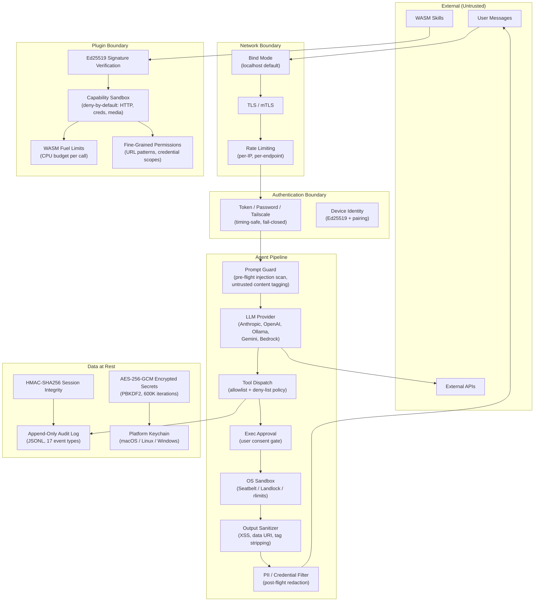

# Security

Security architecture and threat model for carapace.

## Threat Model

The gateway enables an AI agent with:
- Shell command execution
- File read/write access
- Network access
- Message sending to external channels

Attackers can:
- Send messages attempting to manipulate the agent (prompt injection)
- Probe for infrastructure details
- Attempt to escalate access through social engineering

**Core principle**: Access control before intelligence. Most failures are not fancy exploits - they're "someone messaged the bot and the bot did what they asked."

## Security Layers

```
┌─────────────────────────────────────────────────┐
│                  Network Layer                   │
│  Bind mode, TLS, trusted proxies, rate limiting │
├─────────────────────────────────────────────────┤
│               Authentication Layer               │
│    Token/password, device pairing, loopback     │
├─────────────────────────────────────────────────┤
│              Authorization Layer                 │
│   Roles, scopes, channel policies, allowlists   │
├─────────────────────────────────────────────────┤
│                 Execution Layer                  │
│     Sandboxing, tool policies, elevated mode    │
└─────────────────────────────────────────────────┘
```

## Trust Boundary Diagram



## Implementation Checklist

### Authentication (`src/auth/mod.rs`)

- [x] Token verification with constant-time comparison
- [x] Password verification with constant-time comparison
- [x] Loopback detection (bypass auth for local connections)
- [x] Proxy header validation (prevent auth bypass via spoofed headers)
- [x] Device identity verification (public key + signature)

```rust
// Constant-time comparison prevents timing attacks
pub fn constant_time_eq(a: &str, b: &str) -> bool {
    if a.len() != b.len() { return false; }
    let mut result = 0u8;
    for (x, y) in a.bytes().zip(b.bytes()) {
        result |= x ^ y;
    }
    result == 0
}
```

See [Pairing Protocol](protocol/pairing.md) for full token security details.

### Network Security (`src/server/`)

- [x] Bind modes: loopback (default), LAN, tailnet, custom
- [x] Rate limiting per IP (`src/server/ratelimit.rs`)
- [x] Security headers (`src/server/headers.rs`)
- [x] Trusted proxy configuration for `X-Forwarded-For`

**Bind mode defaults to loopback** - only local connections allowed unless explicitly configured.

### Credential Storage (`src/credentials/mod.rs`)

- [x] Encrypted storage for sensitive credentials
- [x] Path sanitization to prevent traversal attacks
- [x] Atomic writes (temp file + rename)

```rust
// Path sanitization prevents directory traversal
let sanitized = plugin_id
    .replace("..", "_")
    .replace(['/', '\\'], "_");
```

### Token Security (`src/nodes/mod.rs`, `src/devices/mod.rs`)

- [x] SHA-256 hashing before storage (never store plaintext)
- [x] Constant-time verification
- [x] Token rotation on re-approval
- [x] Automatic expiry (30 days nodes, 90 days devices)

### Session Security (`src/sessions/store.rs`)

- [x] Session isolation by key
- [x] Atomic file writes
- [x] No cross-session data leakage
- [x] Session ID validation (alphanumeric, hyphens, underscores only)
- [x] Path traversal prevention (`..`, `/`, `\` rejected in session IDs)
- [x] Archived sessions are read-only (writes rejected with `AlreadyArchived` error)
- [x] Defense-in-depth validation at both path construction and `get_session` entry point

```rust
// Session IDs are validated before any path construction
fn validate_session_id(session_id: &str) -> Result<(), SessionStoreError> {
    if session_id.contains("..") || session_id.contains('/') || session_id.contains('\\') {
        return Err(SessionStoreError::InvalidSessionKey(...));
    }
    if !session_id.chars().all(|c| c.is_ascii_alphanumeric() || c == '-' || c == '_') {
        return Err(SessionStoreError::InvalidSessionKey(...));
    }
    Ok(())
}
```

## Sensitive Data Locations

```
~/.moltbot/
├── moltbot.json           # Config (may contain tokens)
├── credentials/            # Channel credentials, allowlists
│   ├── whatsapp/          # WhatsApp session data
│   └── *-allowFrom.json   # Pairing allowlists
├── nodes/
│   └── paired.json        # Node tokens (hashed)
├── devices/
│   └── paired.json        # Device tokens (hashed)
├── agents/<id>/
│   ├── sessions/*.jsonl   # Session transcripts
│   └── auth-profiles.json # API keys, OAuth tokens
└── extensions/            # Installed plugins
```

**File permissions**: Directories should be `700`, files `600`.

## Security Anti-Patterns

### DO NOT:

1. **Store tokens in plaintext**
   ```rust
   // BAD
   paired.token = token.clone();

   // GOOD
   paired.token_hash = hash_token(&token);
   ```

2. **Use string equality for secrets**
   ```rust
   // BAD - timing attack vulnerable
   if provided_token == stored_token { ... }

   // GOOD
   if timing_safe_eq(&provided_token, &stored_token) { ... }
   ```

3. **Trust proxy headers unconditionally**
   ```rust
   // BAD - allows auth bypass
   let client_ip = headers.get("x-forwarded-for");

   // GOOD - verify proxy is trusted first
   if is_trusted_proxy(remote_addr) {
       let client_ip = headers.get("x-forwarded-for");
   }
   ```

4. **Allow path traversal in plugin IDs**
   ```rust
   // BAD
   let path = format!("plugins/{}/config.json", plugin_id);

   // GOOD
   let safe_id = plugin_id.replace("..", "_").replace(['/', '\\'], "_");
   let path = format!("plugins/{}/config.json", safe_id);
   ```

### Input Validation

- [x] UTF-8-safe string truncation using `char_indices()` (prevents panics on multi-byte boundaries)
- [x] Whitespace-only text rejected in system events
- [x] Pagination limits capped server-side (max 1000 for sessions, archives; max 5000 for cron runs)
- [x] Cron job name length validated (max 256 characters)
- [x] Invalid cron schedule/payload inputs rejected with errors (not silently ignored)

## Rate Limiting

Default limits (`src/server/ratelimit.rs`):

| Endpoint | Limit |
|----------|-------|
| HTTP requests | 100/minute per IP |
| WS connections | 10/minute per IP |
| Failed auth | 5/minute per IP |

Exceeding limits returns `429 Too Many Requests`.

## Prompt Injection Considerations

Even with access controls, prompt injection can occur via:
- Web content the agent fetches
- Files the agent reads
- Messages from "trusted" but compromised accounts

**Mitigations** (implemented at agent layer, not gateway):
- Content from external sources treated as untrusted
- Sandboxed execution for tool calls
- Tool allowlists to limit blast radius
- Modern models with better instruction following

## Control UI Security

The control UI (`/control/*` endpoints) requires:
- Gateway authentication (token or password)
- Protected config paths blocked from modification:
  - `gateway.auth.*`
  - `hooks.token`
  - `credentials.*`
  - `secrets.*`

```rust
// From src/server/control.rs
let blocked_prefixes = ["gateway.auth", "hooks.token", "credentials", "secrets"];
for prefix in blocked_prefixes {
    if req.path.starts_with(prefix) {
        return Err(forbidden("Cannot modify protected configuration"));
    }
}
```

## Plugin Security

Plugins run in WASM sandboxes (`src/plugins/runtime.rs`) with:
- Capability-based permissions
- Namespaced tool/webhook paths
- No direct filesystem access (must use host functions)

```rust
// Plugin paths are namespaced to prevent collisions
let webhook_path = format!("/plugins/{}/{}", plugin_id, plugin_path);
```

## Incident Response Checklist

If compromise is suspected:

1. **Stop**: Terminate gateway process
2. **Rotate**:
   - Gateway auth token/password
   - Device/node tokens (revoke + re-pair)
   - API keys in auth-profiles.json
3. **Audit**:
   - Review session transcripts for unexpected tool calls
   - Check gateway logs for suspicious requests
   - Review installed plugins
4. **Harden**:
   - Tighten bind mode (prefer loopback)
   - Enable/strengthen rate limiting
   - Review allowlists

## Known Issues & Open Items

The following issues were identified during security review. Each includes analysis, a recommendation, and the main counterargument considered.

### Priority summary

| Issue | Recommendation | Effort | Risk if deferred |
|-------|---------------|--------|------------------|
| Streaming buffer stall | Fix later | Moderate | Low (self-harm only) |
| Heartbeat parity | Fix when needed | Trivial | None (stub is valid) |
| Cron scope granularity | Defer | Low | None (write-gate exists) |
| Compaction TOCTOU | Defer | Moderate | None (idempotent, no concurrent trigger) |

### Cron scope granularity

**Status**: Deferred.

Cron methods (`cron.add`, `cron.update`, `cron.remove`, `cron.run`) go through `check_method_authorization` in `dispatch_method` (`src/server/ws/handlers/mod.rs`). They are classified as `"write"` role, meaning admin gets full access, operator connections require `operator.write` scope, and node/read-only connections are blocked entirely.

What's missing is a **dedicated scope** (e.g., `operator.cron`) to grant an operator write access to sessions/chat without implicitly granting cron access. Today `operator.write` is an all-or-nothing bundle.

**Why defer**: The gateway is a single-tenant personal agent — the operator is the owner. A dedicated `operator.cron` scope would matter in a multi-tenant or delegated-access scenario, which this project isn't targeting. The existing scope system blocks unauthenticated and read-only connections, which is sufficient for the current threat model.

**Counterargument addressed**: A compromised client with `operator.write` can already call `agent`, `chat.send`, `system-event`, and `sessions.delete`, all equally or more damaging than creating cron jobs. A cron-specific scope wouldn't meaningfully reduce blast radius without splitting every write method into its own scope — overengineering for a single-user gateway.

### TOCTOU race in compaction status check

**Status**: Deferred. Add a `// NOTE:` comment if auto-compaction is ever introduced.

`compact_session` (`src/sessions/store.rs`) reads the session, checks `status != Compacting`, sets status to `Compacting`, writes metadata, then does the work. Two concurrent calls could both pass the check before either writes the `Compacting` status.

**Why defer**: Three factors make this a non-issue in practice:

1. **No concurrent trigger path exists.** Compaction is triggered by explicit client request (`sessions.compact`), not by a background timer. Two concurrent compaction requests for the same session would require a client to deliberately race itself.
2. **Compaction is idempotent.** If two runs overlap, the result is a correctly compacted session — just with wasted CPU. The atomic rename ensures the final history file is consistent regardless of ordering.
3. **The fix has real complexity cost.** Per-session locking requires either a `DashMap<SessionId, Mutex>` or a lock striping scheme, adding code, potential deadlock surface area, and memory overhead for a race condition that essentially can't happen via the WebSocket API (requests are processed sequentially per connection).

**Counterargument addressed**: A future background auto-compaction feature would make this a real race. If auto-compaction is ever added, per-session locking should be added *at that time*. Designing for hypothetical future concurrency now adds complexity without benefit.

### Heartbeat parity with Node.js

**Status**: Deferred until a client depends on it.

`handle_last_heartbeat()` (`src/server/ws/handlers/system.rs`) returns `null` — it's a stub. `handle_set_heartbeats()` accepts `enabled` and `interval` params but doesn't persist or act on them. The Node.js reference implementation tracks a global last-heartbeat timestamp updated on any client heartbeat tick.

**Why defer**: This is a behavioral compatibility gap, not a security or correctness issue. Returning `null` is a valid "no heartbeat received yet" state. If any client depends on a real value, the fix is straightforward: add an `AtomicI64` to `WsServerState`, update it on each tick event, and return it from `handle_last_heartbeat()` (~10 lines of code).

**Counterargument addressed**: The per-connection vs. global distinction only matters if a client asks "when was the last heartbeat from *any* connection?" vs. "when was *my* last heartbeat?" Since `last-heartbeat` is documented as a global query in Node.js and the Rust implementation doesn't track it at all, there's no semantic mismatch — just a missing feature. When implemented, it should match Node.js global semantics.

### Streaming buffer stall risk

**Status**: Fix later. Moderate refactor.

The send path uses `mpsc::UnboundedSender<Message>` (`src/server/ws/mod.rs`). If a client stops reading, messages accumulate without bound. The `MAX_BUFFERED_BYTES` constant (1.5 MB) is defined and reported in the `hello-ok` policy but is **not enforced server-side**.

**Recommended fix**: Switch from `mpsc::unbounded_channel()` to `mpsc::channel(CAPACITY)` where `CAPACITY` is derived from `MAX_BUFFERED_BYTES` (e.g., 1024 messages). Use `try_send()` instead of `send()`. On `Err(TrySendError::Full)`, drop the message and increment a counter. After N consecutive drops, close the connection. This is preferable to a background timer because:

- Backpressure is applied immediately when the buffer fills, not on a timer tick.
- No extra `tokio::spawn` per connection.
- Clear semantics: "if you can't keep up, you get disconnected."

**Effort**: Moderate. Every `send_json()` call site needs to handle the `Full` case.

**Counterargument addressed**: "Just use a timer, it's simpler." A timer adds a `tokio::spawn` per connection, introduces a tuning parameter (how long is "stalled"?), and still lets the buffer grow unbounded between ticks. The bounded channel is both more correct and lower overhead. The counterargument to *both* fixes is that on a single-user gateway, only the operator can create this situation, and they're only hurting themselves — making this the weakest issue of the four.

### Resolved

- **Unbounded cron job creation**: Fixed. `CronScheduler::add()` enforces a hard cap of 500 jobs (`CronError::LimitExceeded`).

## Security Contacts

Found a vulnerability? Report to: security@clawd.bot
