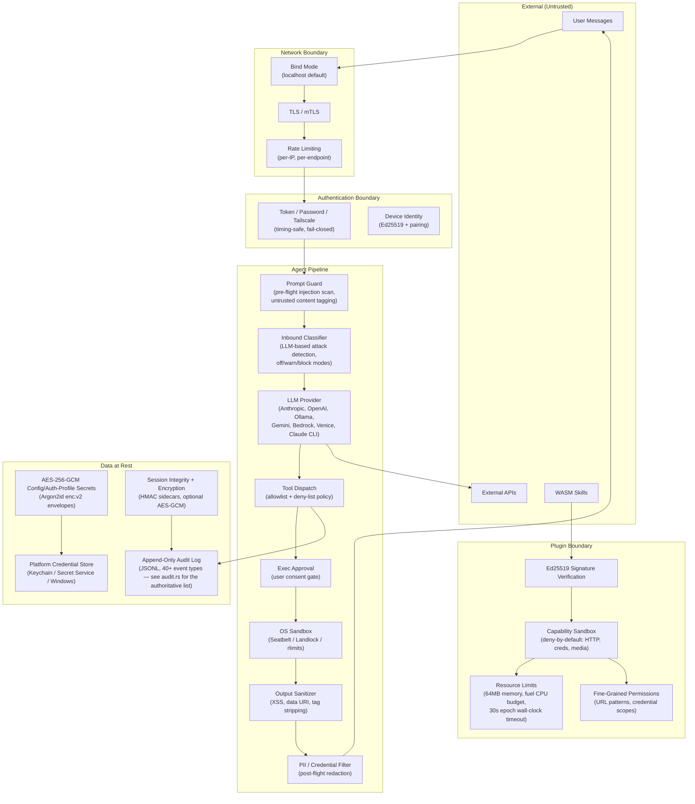

# Security

Security architecture and threat model for Carapace.

## Threat Model

Carapace enables an AI agent with:
- Shell command execution
- File read/write access
- Network access
- Message sending to external channels

Attackers can:
- Send messages attempting to manipulate the agent (prompt injection)
- Probe for infrastructure details
- Attempt to escalate access through social engineering

**Core principle**: Access control before intelligence. Most failures are not fancy exploits - they're "someone messaged the bot and the bot did what they asked."

## Security Layers

```
┌─────────────────────────────────────────────────┐
│                  Network Layer                   │
│  Bind mode, TLS, trusted proxies, rate limiting │
├─────────────────────────────────────────────────┤
│               Authentication Layer               │
│    Token/password, device pairing, loopback     │
├─────────────────────────────────────────────────┤
│              Authorization Layer                 │
│   Roles, scopes, channel policies, allowlists   │
├─────────────────────────────────────────────────┤
│                 Execution Layer                  │
│     Sandboxing, tool policies, elevated mode    │
└─────────────────────────────────────────────────┘
```

## Trust Boundary Diagram


```mermaid
graph TB
    subgraph "External (Untrusted)"
        User[User Messages]
        ExtAPI[External APIs]
        Skills[WASM Skills]
    end

    subgraph "Network Boundary"
        Bind["Bind Mode<br/>(localhost default)"]
        TLS["TLS / mTLS"]
        RateLimit["Rate Limiting<br/>(per-IP, per-endpoint)"]
    end

    subgraph "Authentication Boundary"
        Auth["Token / Password / Tailscale<br/>(timing-safe, fail-closed)"]
        DeviceAuth["Device Identity<br/>(Ed25519 + pairing)"]
    end

    subgraph "Agent Pipeline"
        PromptGuard["Prompt Guard<br/>(pre-flight injection scan,<br/>untrusted content tagging)"]
        Classifier["Inbound Classifier<br/>(LLM-based attack detection,<br/>off/warn/block modes)"]
        LLM["LLM Provider<br/>(Anthropic, OpenAI, Ollama,<br/>Gemini, Bedrock, Venice, Claude CLI)"]
        ToolDispatch["Tool Dispatch<br/>(allowlist + deny-list policy)"]
        ExecApproval["Exec Approval<br/>(user consent gate)"]
        Sandbox["OS Sandbox<br/>(Seatbelt / Landlock / rlimits)"]
        OutputCSP["Output Sanitizer<br/>(XSS, data URI, tag stripping)"]
        PIIFilter["PII / Credential Filter<br/>(post-flight redaction)"]
    end

    subgraph "Data at Rest"
        Secrets["AES-256-GCM Config/Auth-Profile Secrets<br/>(Argon2id enc:v2 envelopes)"]
        Sessions["Session Integrity + Encryption<br/>(HMAC sidecars, optional AES-GCM)"]
        Audit["Append-Only Audit Log<br/>(JSONL, 40+ event types — see audit.rs for the authoritative list)"]
        Keychain["Platform Credential Store<br/>(Keychain / Secret Service / Windows)"]
    end

    subgraph "Plugin Boundary"
        PluginSig["Ed25519 Signature Verification"]
        PluginCaps["Capability Sandbox<br/>(deny-by-default: HTTP, creds, media)"]
        PluginRes["Resource Limits<br/>(64MB memory, fuel CPU budget,<br/>30s epoch wall-clock timeout)"]
        PluginPerms["Fine-Grained Permissions<br/>(URL patterns, credential scopes)"]
    end

    User --> Bind --> TLS --> RateLimit --> Auth
    Auth --> PromptGuard --> Classifier --> LLM
    LLM --> ToolDispatch --> ExecApproval --> Sandbox
    Sandbox --> OutputCSP --> PIIFilter
    PIIFilter --> User

    LLM --> ExtAPI
    ToolDispatch --> Audit

    Skills --> PluginSig --> PluginCaps --> PluginRes
    PluginCaps --> PluginPerms

    Secrets --> Keychain
    Sessions --> Audit
```

The structured audit log defines 40 `AuditEvent` variants (see
`src/logging/audit.rs` for the authoritative enumeration; this count rolls forward
as new variants land). Operator-initiated Matrix device verification actions
(start / accept / confirm / cancel) emit the typed `matrix_verification_action`
event with `action`, `flow_id`, `outcome`, `actor`, `remote_ip`, and (on confirm)
the SAS-match decision — the SAS digest itself is intentionally not included
since it is a one-time-use challenge with no value after the flow completes.

**`actor` field shape.** Most audit events record the operator as the direct
TCP peer IP (via `control_actor`). For `matrix_verification_action` specifically
(the audit variant added for cross-device-trust forensics), the daemon uses
`principal_aware_control_actor`: when the caller authenticated via Tailscale
AND did NOT also present a bearer token, `actor` is `tailscale:<user>` where
`<user>` is the tailnet login, control-chars stripped, byte-capped at 255.
This distinguishes individual tailnet identities that all terminate on
loopback through `tailscale serve` — without it, every tailscale-authed
SAS confirm would report `actor: "127.0.0.1"`. When a bearer token is
presented (whether or not it validates), the bearer-token caller's IP wins:
the operator's explicit credential is a stronger attribution than the
network-derived tailnet identity. `remote_ip` always carries the direct
TCP peer IP regardless of `actor` shape, so audit consumers parsing the
field can recover the network attribution unambiguously. Consumers
parsing the `actor` field MUST split on the FIRST `:` only — the
`<user>` portion is allowed to contain additional `:` characters
(e.g. a `tag:server@host` tailnet identity), and naive
`actor.split(':')` would mis-split those. Matrix
maintenance and verification flows also emit stable `audit_event` log tags,
including `matrix_sas_unsafe_skip`, `matrix_recovery_key_restore`,
`matrix_recovery_key_restore_cleanup_resumed`,
`matrix_store_rekey_start`, `matrix_store_rekey_complete`,
`matrix_cross_signing_bootstrapped`,
`matrix_recovery_key_restored_at_startup`,
`matrix_recovery_key_first_mint`, `matrix_recovery_key_rotate`,
`matrix_recovery_key_rotate_recovered`, and
`matrix_device_verification_confirmed`. The list above is illustrative,
not exhaustive — consult `src/logging/audit.rs` and `git grep audit_event = `
for the full set. The daemon audit writer emits the
durable `audit_events_dropped` marker after recovering from bounded-queue
overflow so operators can distinguish successful audit delivery from recorded
loss. Update startup-health failures emit the
durable `update_healthy_marker_failed` audit event. Startup cleanup also emits
`update_healthy_evidence_cleanup_failed` when stale startup-health evidence
cannot be removed after a healthy mark. Matrix recovery-key restore cleanup
emits `matrix_recovery_key_restore_cleanup_failed` with redacted artifact
labels and snake_case `error_kind` values when stale rotation artifacts survive
a CLI restore, and daemon restart recovery emits
`matrix_recovery_key_pending_promotion_refused` with typed marker
stage, reason, artifact labels, and key-state categories when a pending key
cannot be proven safe to promote. Its JSONL payload fields are `marker_stage`,
`reason`, `artifacts`, `current_key`, and `pending_key`; those fields contain
typed categories only, never filesystem paths or key digests. Malformed typed or
unknown legacy rotation markers emit `matrix_recovery_key_rotation_marker_invalid`.
Promotion refusal `reason` values are
`missing_previous_key_digest`, `missing_new_key_digest`, `pending_key_missing`,
`pending_key_digest_mismatch`, `current_key_mismatch`, `current_key_missing`,
`unbound_started_pending`, `final_stage_pending_present`, and
`legacy_marker_missing_previous_key_digest`; marker-invalid reasons are
`corrupt_typed_marker` and `unknown_legacy_marker`. `audit_blocking` is the
synchronous CLI writer for this same operator-facing JSONL surface and writes
directly to the supplied state directory when no in-process daemon writer owns
that directory. Same-state-dir direct writes are refused so audit rotation has
one owner.

## Implementation Checklist

### Authentication (`src/auth/mod.rs`)

- [x] Token verification with constant-time comparison
- [x] Password verification with constant-time comparison
- [x] Loopback detection (bypass auth for local connections)
- [x] Proxy header validation (prevent auth bypass via spoofed headers)
- [x] Device identity verification (public key + signature)

```rust
// Constant-time comparison prevents timing attacks.
// Both inputs are SHA-256 hashed first so the XOR loop always
// compares fixed-length digests — no length side-channel.
pub fn timing_safe_eq(a: &str, b: &str) -> bool {
    use sha2::{Digest, Sha256};
    let hash_a = Sha256::digest(a.as_bytes());
    let hash_b = Sha256::digest(b.as_bytes());
    let mut out = 0u8;
    for (x, y) in hash_a.iter().zip(hash_b.iter()) {
        out |= x ^ y;
    }
    out == 0
}
```

See [Pairing Protocol](protocol/pairing.md) for full token security details.

### Network Security (`src/server/`)

- [x] Bind modes: loopback (default), LAN, tailnet, custom
- [x] Rate limiting per IP (`src/server/ratelimit.rs`)
- [x] Security headers (`src/server/headers.rs`)
- [x] Trusted proxy configuration for `X-Forwarded-For`

**Bind mode defaults to loopback** - only local connections allowed unless explicitly configured.

### Credential Storage (`src/credentials/mod.rs`)

- [x] Platform credential stores for persisted gateway, device, and plugin secrets
- [x] Metadata-only credential index in `credentials/index.json`
- [x] Env-only degraded mode when the platform credential store is unavailable
- [x] CLI device identity file fallback can be disabled with `CARAPACE_DEVICE_IDENTITY_STRICT=1`
- [x] Startup refusal when known plaintext credential files are detected
- [x] Path sanitization to prevent traversal attacks
- [x] Atomic writes (temp file + rename)

```rust
// Path sanitization prevents directory traversal
let sanitized = plugin_id
    .replace("..", "_")
    .replace(['/', '\\'], "_");
```

### Token Security (`src/nodes/mod.rs`, `src/devices/mod.rs`)

- [x] SHA-256 hashing before storage (never store plaintext)
- [x] Constant-time verification
- [x] Token rotation on re-approval
- [x] Automatic expiry (30 days nodes, 90 days devices)

### Session Security (`src/sessions/store.rs`)

- [x] Session isolation by key
- [x] Atomic file writes
- [x] No cross-session data leakage
- [x] Session ID validation (alphanumeric, hyphens, underscores only)
- [x] Path traversal prevention (`..`, `/`, `\` rejected in session IDs)
- [x] Archived sessions are read-only (writes rejected with `AlreadyArchived` error)
- [x] Defense-in-depth validation at both path construction and `get_session` entry point
- [x] `manifest_integrity_failed` reports whole-session manifest authenticity
      failure. Treat it as fail-closed session history corruption: repair or
      restore the session manifest/history together before replaying Matrix
      inbound work. This is distinct from per-record decrypt failures, which
      can affect one encrypted record without invalidating the session manifest.

```rust
// Session IDs are validated before any path construction
fn validate_session_id(session_id: &str) -> Result<(), SessionStoreError> {
    if session_id.contains("..") || session_id.contains('/') || session_id.contains('\\') {
        return Err(SessionStoreError::InvalidSessionKey(...));
    }
    if !session_id.chars().all(|c| c.is_ascii_alphanumeric() || c == '-' || c == '_') {
        return Err(SessionStoreError::InvalidSessionKey(...));
    }
    Ok(())
}
```

## Sensitive Data Locations

Example uses the Linux config directory (`~/.config/carapace`).

```
~/.config/carapace/
├── carapace.json5          # Config (may contain tokens)
├── credentials/
│   ├── index.json          # Non-secret credential metadata for OS keyring entries
│   └── index.json.bak      # Best-effort index backup
├── device-identity.json    # CLI fallback identity only when keyring is unavailable
├── nodes/
│   └── paired.json        # Node tokens (hashed)
├── devices/
│   └── paired.json        # Device tokens (hashed)
├── sessions/
│   ├── .crypto-manifest   # Session-encryption root salt + manifest integrity tag; required to decrypt encrypted session artifacts
│   └── *.jsonl            # Session transcripts (encrypted at rest when sessions.encryption.mode permits it and CARAPACE_CONFIG_PASSWORD is set)
├── auth_profiles.json     # Provider auth profiles; token fields encrypt when CARAPACE_CONFIG_PASSWORD is set
├── tasks/
│   └── queue.json         # Durable task payload/state (plaintext operational data)
├── installation_id        # Per-installation HKDF salt (Matrix store-key derivation; not nested under matrix/)
├── matrix/                # Matrix runtime state (when matrix.enabled = true)
│   ├── store_passphrase            # Owner-only random passphrase pinning the SDK store key (post-rekey-store)
│   ├── store_passphrase.pending    # Mid-rotation pending passphrase (only present during an in-flight rekey)
│   ├── store_passphrase.rekeying   # In-flight rekey marker (do not delete; rerun rekey-store --new to advance)
│   ├── recovery_key                # Server-side cross-signing recovery passphrase (durable; required for past-history decryption)
│   ├── recovery_key.minting        # Crash-recovery marker for an in-flight recovery enable (do not delete)
│   ├── recovery_key.pending        # Pending recovery key staged by `cara matrix recovery-key restore` (promoted on next start)
│   ├── recovery_key.rotating       # Crash-recovery marker for in-flight recovery-key rotation (do not delete)
│   ├── recovery_key.cleanup        # Restore-cleanup journal; started journals require inspection before daemon restart
│   ├── inbound_dlq.jsonl           # Live inbound DLQ — failed inbound dispatches awaiting replay
│   ├── inbound_dlq.corrupt.jsonl   # Quarantine for undecodable DLQ records (forensic, owner-only)
│   └── *.sqlite*                   # matrix-sdk SQLite encrypted state (cipher rotated by rekey-store --new)
├── .matrix-rekey.lock.lock # Internal FileLock sentinel for the public `{state_dir}/.matrix-rekey.lock` maintenance lock
├── daemon.pid             # Live daemon PID (owner-only); process liveness marker
└── plugins/               # Managed plugin artifacts
```

**Matrix store note**: When `matrix.encrypted = true`, the matrix-sdk SQLite
store is rekeyed via `cara matrix rekey-store --new`. The CLI refuses to run
while it cannot take the public `{state_dir}/.matrix-rekey.lock` maintenance
lock; in raw state-dir listings the internal FileLock sentinel appears as
`{state_dir}/.matrix-rekey.lock.lock`. Stop the daemon first.
If the rotation is interrupted (`store_passphrase.pending` and/or
`store_passphrase.rekeying` exist without the final `store_passphrase`),
the daemon refuses to start with a
`Matrix store rekey interrupted: ...` error (see
[Channel Setup → Matrix store rekey lifecycle](channels.md#matrix-store-rekey-lifecycle)
for the canonical error string and recovery procedure). Recovery is to re-run
the same command, which is idempotent and advances or rolls back the
in-flight rotation. Do not delete the marker / pending files manually.

**File permissions**: Directories should be `700`, files `600`.
**Plaintext credential refusal**: Gateway startup scans known credential paths
for plaintext credential shapes and refuses to start if they are present. Delete
the files and re-enroll credentials through the current setup/import flows.
**Config secret note**: `enc:v2:` is the supported config-secret envelope.
Unsupported `enc:v*` values fail config load instead of being treated as plain
strings or silently scrubbed.
**Encrypted-session backup note**: If session encryption is enabled, back up
`.crypto-manifest` with the rest of the Carapace state. The config password
alone is not enough to recover encrypted sessions if that manifest is lost.
**Encrypted-session rotation note**: There is currently no in-place session
rekey flow. Changing `CARAPACE_CONFIG_PASSWORD` does not re-encrypt existing
session artifacts; if the password must change, export or delete the existing
encrypted sessions and start a fresh session store.
**Task payload note**: `tasks/queue.json` is plaintext durable state for operator
workflows. Do not store raw secrets in task payload text.
Malformed task queues fail closed on startup and are copied to bounded
`queue.json.corrupt.*` backups for operator inspection.
**CLI backup note**: `cara backup` archives sessions, config, memory, cron,
tasks, and usage sections when present. It does not export OS credential-store
secrets, `auth_profiles.json`, managed plugin binaries, node/device registries,
or arbitrary state-dir files outside those sections.

## Security Anti-Patterns

### DO NOT:

1. **Store tokens in plaintext**
   ```rust
   // BAD
   paired.token = token.clone();

   // GOOD
   paired.token_hash = hash_token(&token);
   ```

2. **Use string equality for secrets**
   ```rust
   // BAD - timing attack vulnerable
   if provided_token == stored_token { ... }

   // GOOD
   if timing_safe_eq(&provided_token, &stored_token) { ... }
   ```

3. **Trust proxy headers unconditionally**
   ```rust
   // BAD - allows auth bypass
   let client_ip = headers.get("x-forwarded-for");

   // GOOD - verify proxy is trusted first
   if is_trusted_proxy(remote_addr) {
       let client_ip = headers.get("x-forwarded-for");
   }
   ```

4. **Allow path traversal in plugin IDs**
   ```rust
   // BAD
   let path = format!("plugins/{}/config.json", plugin_id);

   // GOOD
   let safe_id = plugin_id.replace("..", "_").replace(['/', '\\'], "_");
   let path = format!("plugins/{}/config.json", safe_id);
   ```

### Input Validation

- [x] UTF-8-safe string truncation using `char_indices()` (prevents panics on multi-byte boundaries)
- [x] Whitespace-only text rejected in system events
- [x] Pagination limits capped server-side (max 1000 for sessions, archives; max 5000 for cron runs)
- [x] Cron job name length validated (max 256 characters)
- [x] Invalid cron schedule/payload inputs rejected with errors (not silently ignored)

## Rate Limiting

Default limits (`src/server/ratelimit.rs`). All HTTP-side limits are
token-bucket per remote IP with `exempt_loopback: true` by default — so
local-direct callers (and tailscale-Serve-proxied requests, which
terminate on loopback) bypass HTTP rate limiting entirely:

| Endpoint prefix | Rate (req/s) | Burst | Source |
|-----------------|--------------|-------|--------|
| (default — any path not matched below) | 100 | 200 | `DEFAULT_RATE` / `DEFAULT_BURST` |
| `/hooks/` | 50 | 100 | `RouteLimitConfig::new("/hooks/", 50, 100)` |
| `/tools/` | 50 | 100 | `RouteLimitConfig::new("/tools/", 50, 100)` |
| `/control/matrix/verifications/` | 5 | 10 | Matrix SAS verification mutations (accept/confirm/cancel) — operator-paced |
| `/control/matrix/verifications` | 60 | 120 | Matrix verification list-GET + start-POST — UI-polled |
| `/control/matrix/send-test` | 5 | 10 | Matrix maintenance probe |

The trailing-slash distinction matters: `RouteLimitConfig` lookup is
first-prefix-wins, so `/control/matrix/verifications/<flow>/confirm`
(slash-bearing, mutation) resolves to the tight 5/10 bucket, while
`/control/matrix/verifications` (no trailing slash, list-GET +
start-POST) resolves to the larger 60/120 bucket that accommodates
UI polling.

WebSocket connections have NO per-IP connection-rate limit. Each
WebSocket connection enforces a per-connection message rate via
`WsRateLimiter` (defaults `DEFAULT_WS_MESSAGE_RATE = 60` messages/s with
a 120-message burst).

There is no dedicated failed-auth rate limiter. Failed
`check_control_auth` returns 401 without recording an audit event; brute-
force detection is left to the network layer / reverse proxy in front of
the gateway.

Exceeding the HTTP rate limit returns `429 Too Many Requests`.

## Prompt Injection Considerations

Even with access controls, prompt injection can occur via:
- Web content the agent fetches
- Files the agent reads
- Messages from "trusted" but compromised accounts

**Mitigations** (agent layer, not transport/runtime layer):
- Inbound message classifier (LLM-based, off/warn/block modes) — secondary LLM
  call classifies messages for prompt injection, social engineering, instruction
  override, data exfiltration, and tool abuse before the main agent loop. Fail-open
  on errors. See `src/agent/classifier.rs`.
- Content from external sources treated as untrusted
- Sandboxed execution for tool calls
- Tool allowlists to limit blast radius
- Modern models with better instruction following

## Control UI Security

The control UI (`/control/*` endpoints) requires:
- Service authentication (token or password)
- CSRF protection (double-submit cookie with `__Host-` prefix, `SameSite=Strict`, origin/host validation)
- Config mutation split:
  - `PATCH /control/config` is restricted to the exact paths `gateway.controlUi.enabled` and `gateway.controlUi.basePath`
- Protected config prefixes blocked from control mutation include auth/hooks/credentials/secrets plus provider and channel secrets (for example `anthropic.apiKey`, `openai.apiKey`, `google.apiKey`, `venice.apiKey`, `bedrock.secretAccessKey`, `telegram.botToken`, `discord.botToken`, `slack.signingSecret`) and provider endpoint overrides (`*.baseUrl`).

```rust
// From src/server/control.rs
let path = req.path.trim();

for prefix in PROTECTED_CONFIG_PREFIXES {
    if path.starts_with(prefix) {
        return Err(forbidden("Cannot modify protected configuration"));
    }
}

if !is_allowed_control_ui_config_path(path) {
    return Err(forbidden(
        "Control API config writes are limited to gateway.controlUi.enabled and gateway.controlUi.basePath",
    ));
}
```

## Plugin Security

Plugins run in WASM sandboxes (`src/plugins/runtime.rs`) with:
- Capability-based permissions (deny-by-default for HTTP, credentials, media)
- Resource limits: 64MB memory (via `ResourceLimiter`), fuel-based CPU budget (1B instructions), 30s wall-clock timeout (epoch interruption)
- HTTP rate limiting (100 req/min) and log rate limiting (1000 msg/min)
- Fine-grained permission enforcement (URL patterns, credential scopes)
- Namespaced tool/webhook paths
- No direct filesystem access (must use host functions)

```rust
// Plugin paths are namespaced to prevent collisions
let webhook_path = format!("/plugins/{}/{}", plugin_id, plugin_path);
```

## Filesystem Tool Security

Built-in filesystem tools are separate from the WASM plugin runtime and are
guarded by explicit config and path validation:

- Disabled by default. Operators must opt in with `filesystem.enabled = true`.
- Access is limited to explicit `filesystem.roots`; paths outside those roots
  are denied.
- `filesystem.excludePatterns` can deny subpaths even when they are inside an
  allowed root.
- Write operations are separately gated by `filesystem.writeAccess = true`.
- Path validation canonicalizes paths before I/O, so `..` escapes and symlinks
  that resolve outside allowed roots are denied.
- Filesystem operations still have an accepted local TOCTOU limitation: path
  validation happens before later file operations, so a local filesystem change
  can still race between validation and use.
- Filesystem tools still go through the normal tool policy layer, so operators
  can allow-list or deny-list them in addition to the root/exclude controls.
- Invalid filesystem config fail-closes: schema validation blocks bad config at
  startup, and runtime tool registration disables the filesystem tool set if a
  malformed config somehow bypasses validation.
- Tool registration happens at startup; changing `filesystem.*` requires a
  process restart.

## Incident Response Checklist

If compromise is suspected:

1. **Stop**: Terminate the Carapace process
2. **Rotate**:
   - Service auth token/password
   - Device/node tokens (revoke + re-pair)
   - API keys or OAuth tokens in `auth_profiles.json`
3. **Audit**:
   - Review session transcripts for unexpected tool calls
   - Check Carapace logs for suspicious requests
   - Review installed plugins
4. **Harden**:
   - Tighten bind mode (prefer loopback)
   - Enable/strengthen rate limiting
   - Review allowlists

## Known Issues & Open Items

The following issues were identified during security review. Each includes analysis, a recommendation, and the main counterargument considered.

### Priority summary

| Issue | Recommendation | Effort | Risk if deferred |
|-------|---------------|--------|------------------|
| Streaming buffer stall | Fix later | Moderate | Low (self-harm only) |
| Cron scope granularity | Defer | Low | None (write-gate exists) |
| Compaction TOCTOU | Defer | Moderate | None (idempotent, no concurrent trigger) |
| HTTP/1 body-dribble + idle-keep-alive | Document for operators | Low (proxy config) | Low on loopback / tailscale, Medium on public-internet |

### HTTP/1 body-dribble + idle-keep-alive

**Status**: Documented; partial defense in carapace itself.

The TLS listener at `src/main.rs` (`launch_tls_server`) pins HTTP/1
via `http1_only()` and enforces a 30-second `header_read_timeout`,
closing the classic slowloris header-dribble vector. Two residual
slowloris-class vectors remain because hyper's HTTP/1 server has no
built-in knobs for them:

- **Body dribble**: an attacker who completes valid headers can then
  advertise `Content-Length: <large>` and dribble body bytes
  indefinitely. Each such connection holds an FD plus a server task.
  See `hyperium/hyper#2864` for the upstream tracking issue.
- **Idle keep-alive**: an attacker who completes one valid request
  can hold the keep-alive connection idle indefinitely with no
  further bytes; hyper's HTTP/1 server has no idle-keep-alive
  timeout knob.

For loopback or tailscale-Serve deployments the practical exposure
is narrow (loopback requires local code-exec, tailscale-Serve requires
an authenticated tailnet peer). For **public-internet deployments**
behind a forwarding reverse proxy operators SHOULD set:

- A reverse-proxy-level request-body timeout (e.g., nginx
  `client_body_timeout 30s`, Caddy's `read_timeout`, or
  `tower_http::timeout::RequestBodyTimeoutLayer` if integrating with
  another fronting service).
- An explicit `tcp_keepalive` on the listener socket as an
  idle-connection backstop.

The existing 30s carapace header timeout still applies; the proxy
defense is an additive layer for the residual gaps.

### Cron scope granularity

**Status**: Deferred.

Cron methods (`cron.add`, `cron.update`, `cron.remove`, `cron.run`) go through `check_method_authorization` in `dispatch_method` (`src/server/ws/handlers/mod.rs`). They are classified as `"write"` role, meaning admin gets full access, operator connections require `operator.write` scope, and node/read-only connections are blocked entirely.

What's missing is a **dedicated scope** (e.g., `operator.cron`) to grant an operator write access to sessions/chat without implicitly granting cron access. Today `operator.write` is an all-or-nothing bundle.

**Why defer**: Carapace is a single-tenant personal agent — the operator is the owner. A dedicated `operator.cron` scope would matter in a multi-tenant or delegated-access scenario, which this project isn't targeting. The existing scope system blocks unauthenticated and read-only connections, which is sufficient for the current threat model.

**Counterargument addressed**: A compromised client with `operator.write` can already call `agent`, `chat.send`, `system-event`, and `sessions.delete`, all equally or more damaging than creating cron jobs. A cron-specific scope wouldn't meaningfully reduce blast radius without splitting every write method into its own scope — overengineering for a single-user personal assistant.

### TOCTOU race in compaction status check

**Status**: Deferred. Add a `// NOTE:` comment if auto-compaction is ever introduced.

`compact_session` (`src/sessions/store.rs`) reads the session, checks `status != Compacting`, sets status to `Compacting`, writes metadata, then does the work. Two concurrent calls could both pass the check before either writes the `Compacting` status.

**Why defer**: Three factors make this a non-issue in practice:

1. **No concurrent trigger path exists.** Compaction is triggered by explicit client request (`sessions.compact`), not by a background timer. Two concurrent compaction requests for the same session would require a client to deliberately race itself.
2. **Compaction is idempotent.** If two runs overlap, the result is a correctly compacted session — just with wasted CPU. The atomic rename ensures the final history file is consistent regardless of ordering.
3. **The fix has real complexity cost.** Per-session locking requires either a `DashMap<SessionId, Mutex>` or a lock striping scheme, adding code, potential deadlock surface area, and memory overhead for a race condition that essentially can't happen via the WebSocket API (requests are processed sequentially per connection).

**Counterargument addressed**: A future background auto-compaction feature would make this a real race. If auto-compaction is ever added, per-session locking should be added *at that time*. Designing for hypothetical future concurrency now adds complexity without benefit.

### Streaming buffer stall risk

**Status**: Fix later. Moderate refactor.

The send path uses `mpsc::UnboundedSender<Message>` (`src/server/ws/mod.rs`). If a client stops reading, messages accumulate without bound. The `MAX_BUFFERED_BYTES` constant (1.5 MB) is defined and reported in the `hello-ok` policy but is **not enforced server-side**.

**Recommended fix**: Switch from `mpsc::unbounded_channel()` to `mpsc::channel(CAPACITY)` where `CAPACITY` is derived from `MAX_BUFFERED_BYTES` (e.g., 1024 messages). Use `try_send()` instead of `send()`. On `Err(TrySendError::Full)`, drop the message and increment a counter. After N consecutive drops, close the connection. This is preferable to a background timer because:

- Backpressure is applied immediately when the buffer fills, not on a timer tick.
- No extra `tokio::spawn` per connection.
- Clear semantics: "if you can't keep up, you get disconnected."

**Effort**: Moderate. Every `send_json()` call site needs to handle the `Full` case.

**Counterargument addressed**: "Just use a timer, it's simpler." A timer adds a `tokio::spawn` per connection, introduces a tuning parameter (how long is "stalled"?), and still lets the buffer grow unbounded between ticks. The bounded channel is both more correct and lower overhead. The counterargument to *both* fixes is that on a single-user assistant, only the operator can create this situation, and they're only hurting themselves — making this the weakest issue of the four.

### Resolved

- **Unbounded cron job creation**: Fixed. `CronScheduler::add()` enforces a hard cap of 500 jobs (`CronError::LimitExceeded`).
- **Unknown auth mode fall-through**: Unknown `gateway.auth.mode` values now return a hard error instead of silently falling back to auto-detect.
- **CSRF disabled by default**: `enable_csrf` now defaults to `true` in `MiddlewareConfig`.
- **Duplicate timing-safe comparison**: Removed the length-leaking `timing_safe_equal` from CSRF module; all call sites now use the SHA-256-based `timing_safe_eq` from `auth`.
- **Credential store read failure swallowed**: `read_gateway_auth` errors now propagate at startup instead of defaulting to empty credentials.
- **Device token issuance fallback**: `ensure_device_token` returns `Result`; failures send an error response and close the connection instead of proceeding with a phantom credential.
- **Whitespace-only credentials accepted**: `normalize_credential` now trims and rejects whitespace-only tokens and passwords.
- **`PermissionEnforcer::permissive()` reachable from builder**: Plugin host builder now requires an explicit `PermissionEnforcer` instead of falling back to permissive.
- **Sandbox default disabled on missing field**: `SandboxConfig::enabled` now defaults to `true` via a custom serde default function instead of `bool::default()` (`false`).
- **Exec approvals parse failure fall-through**: Invalid JSON in the exec approvals file now falls back to `deny` mode with a warning instead of `ask`.
- **Credential memory not zeroed on drop**: `GatewayAuthSecrets` derives `ZeroizeOnDrop`; `ResolvedGatewayAuth` has a manual `Drop` impl that zeroizes token and password fields.
- **AuthMode::None + Tailscale interaction**: Added tests confirming `AuthMode::None` correctly bypasses Tailscale checks for local connections and rejects remote connections regardless of `allow_tailscale`.
- **Heartbeat state persistence**: `last-heartbeat` now returns the last heartbeat timestamp and `set-heartbeats` updates interval/enablement in state.

## Security Contacts

Report vulnerabilities privately via GitHub advisories:
https://github.com/puremachinery/carapace/security/advisories/new

If that form is unavailable, open a public issue titled
`Security Contact Request` with no vulnerability details so we can move the
report to a private channel.
